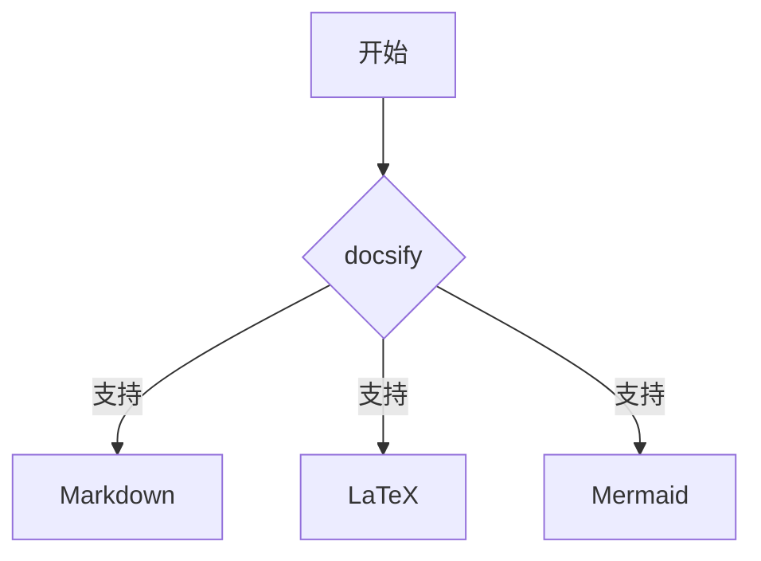

# Headline

> An awesome project.


下面是一个适合作为docsify初始页面的内容示例，你可以将其放入`index.html`或`README.md`中，包含常用组件和文档结构：

```markdown
# Awesome Docsify Starter

> 一个开箱即用的文档模板，专为GitHub Pages部署设计

欢迎使用这个轻量级文档框架！以下示例展示了docsify的核心功能，直接部署即可看到效果。

## 🚀 快速开始
1. 克隆仓库到本地
```bash
git clone https://github.com/yourname/reponame.git
cd reponame
```

2. 启动本地服务
```bash
docsify serve docs
```

## ✨ 特性展示
- **实时渲染** - 修改Markdown即刻生效
- **主题定制** - 内置`darkly`主题（https://cdn.jsdelivr.net/npm/docsify-themeable@0/dist/css/theme/darkly.css）
- **响应式设计** - 在手机/平板/PC完美适配
- **SEO友好** - 自动生成页面标题

## 🧩 组件示例

### 表格对比
| 功能         | docsify | GitBook |
|--------------|---------|---------|
| 构建速度     | ⚡ 即时  | ⏳ 需编译 |
| 依赖项       | 无      | Node.js |
| 学习曲线     | 简单    | 中等    |

### 流程图


### 数学公式
行内公式：$\sqrt{3x-1}+(1+x)^2$

块级公式：
$$ \Gamma(z) = \int_0^\infty t^{z-1}e^{-t}dt $$

## 🌐 部署指南
1. 在GitHub仓库启用Pages服务
2. 选择`/docs`目录作为源
3. 访问：`https://<你的用户名>.github.io/<仓库名>`

> 💡 提示：启用单页面应用路由模式可解决404问题：
> ```html
> <script>
>   window.$docsify = {
>     alias: { '/.*': '/' },
>     notFoundPage: '404.md'
>   }
> </script>
> ```

## 📚 资源推荐
- https://docsify.js.org
- https://docsify.js.org/#/awesome
- https://fontawesome.com

advanced.md
```

### 部署前需完成：
1. 在`docs`目录创建以下文件：
   - `index.html` (主入口)
   - `README.md` (放上面的内容)
   - `advanced.md` (进阶文档)
   - `404.md` (错误页面)

2. `index.html`基础配置：
```html
<!DOCTYPE html>
<html>
<head>
  <meta charset="UTF-8">
  <title>Awesome Documentation</title>
  <link rel="stylesheet" href="//cdn.jsdelivr.net/npm/docsify-themeable@0/dist/css/theme/darkly.css">
</head>
<body>
  <div id="app"></div>
  <script>
    window.$docsify = {
      name: 'Awesome Docs',
      repo: 'https://github.com/yourname/reponame',
      loadSidebar: true,
      subMaxLevel: 2
    }
  </script>
  <script src="//cdn.jsdelivr.net/npm/docsify/lib/docsify.min.js"></script>
  <script src="//cdn.jsdelivr.net/npm/docsify/lib/plugins/search.min.js"></script>
  <script src="//cdn.jsdelivr.net/npm/docsify/lib/plugins/mermaid.min.js"></script>
  <script src="//cdn.jsdelivr.net/npm/docsify/lib/plugins/mathjax.min.js"></script>
</body>
</html>
```

### 效果预览：
- 左侧自动生成导航栏
- 右上角显示GitHub角标
- 支持语法高亮/Mermaid图表/LaTeX公式
- 页面顶部有搜索框
- 深色主题界面

部署到GitHub Pages后，系统会自动将`/docs`目录下的内容发布为网站。此模板已包含常见文档元素，可直接用于项目文档、知识库或技术博客。